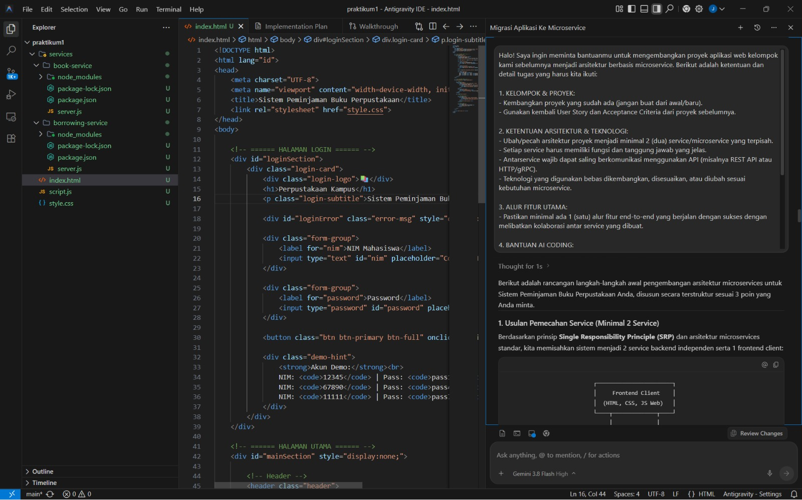
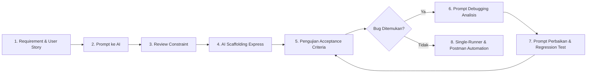
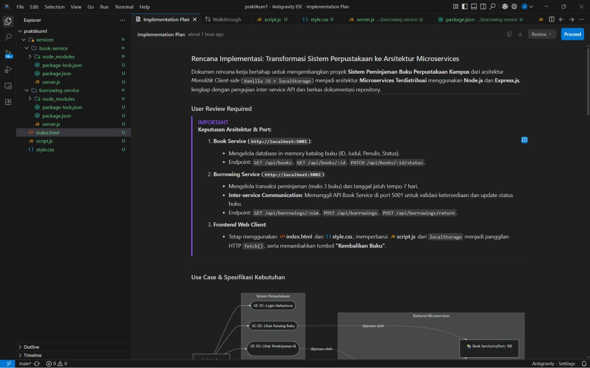
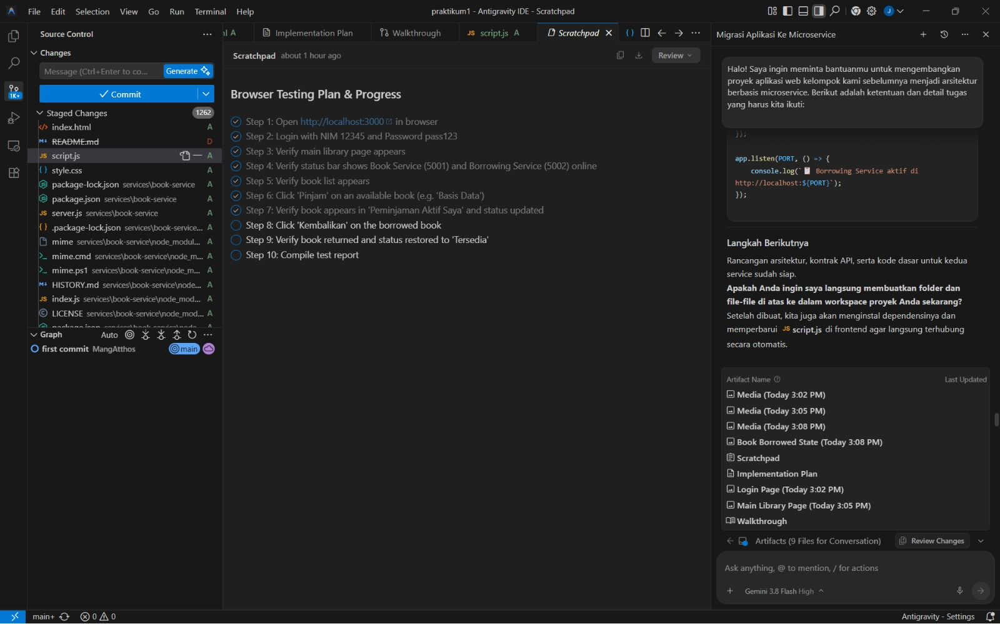
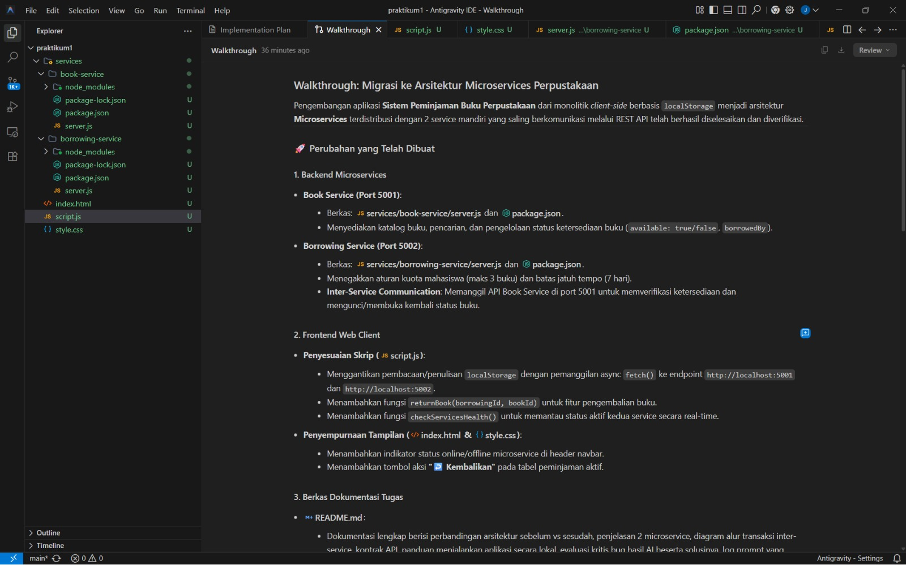

# 🤖 Dokumentasi Penggunaan AI Coding Tool & Analisis Bug

Dokumen ini memuat catatan komprehensif mengenai penerapan **AI Coding Tool** dalam perancangan, pembuatan kode, penemuan bug, *debugging*, dan validasi pada tugas pengembangan arsitektur Microservices Sistem Perpustakaan.

---

## 1. Identitas AI Coding Tool yang Digunakan

* **Nama Tool / IDE**: Google Antigravity IDE
* **Model AI (LLM)**: Gemini 3.8 Flash (High)
* **Peran AI**: AI Coding Assistant (membantu analisis requirement, perancangan arsitektur, scaffolding kode, pembuatan Postman collection, dan debugging).
* **Prinsip Utama**: *Human-in-the-Loop* (Developer memegang kendali penuh atas arsitektur dan requirement, AI digunakan sebagai akselerator implementasi).

---

## 2. Peran AI dalam Setiap Tahapan Pengembangan



<details>
<summary><b>Klik untuk melihat diagram alur AI-Assisted Development</b></summary>


</details>



### A. Tahap Analisis & Dekomposisi Layanan (Microservices Decomposition)
* **Bantuan AI**: Membantu membagi sistem perpustakaan monolitik menjadi 2 domain terpisah:
  1. *Book Service*: Domain pengelolaan data dan status katalog buku.
  2. *Borrowing Service*: Domain pengelolaan transaksi dan batasan peminjaman mahasiswa.
* **Peran Developer**: Membatasi agar AI tidak menggunakan framework yang terlalu kompleks (seperti NestJS, Docker, atau database SQL/NoSQL yang berat), melainkan tetap menggunakan *Express.js* ringan dengan penyimpanan *in-memory* sesuai kebutuhan praktikum.

### B. Tahap Implementasi Komunikasi Antar-Service
* **Bantuan AI**: Menghasilkan boilerplate komunikasi HTTP REST API menggunakan *Native Fetch API* di Node.js.
* **Peran Developer**: Memastikan kode penanganan galat (*error handling*) diterapkan dengan baik, seperti respons `503 Service Unavailable` jika Book Service offline saat dihubungi oleh Borrowing Service.

### C. Tahap Integrasi Single-Terminal & Otomatisasi Postman
* **Bantuan AI**: Merancang koleksi JSON Postman Collection v2.1.0 dengan pengujian asersi otomatis, serta script runner *Newman CLI* dan `start.bat`.
* **Peran Developer**: Memastikan seluruh service (Port 5001, Port 5002, dan Port 3000) dapat dijalankan dalam 1 terminal tanpa tabrakan port (*port conflict*).

---

## 3. Studi Kasus Bug Hasil AI & Proses Debugging

Sesuai ketentuan tugas praktikum (*"Periksa dan perbaiki kode yang dihasilkan AI. Jangan langsung menggunakan hasil AI tanpa pemeriksaan"*), berikut adalah temuan kesalahan nyata dari kode hasil AI dan alur perbaikannya:

### A. Masalah / Bug yang Ditemukan
* **Kategori**: Kesalahan Logika Bisnis (*Business Logic Flaw* pada skenario Multi-User).
* **Pelanggaran**: Melanggar **Acceptance Criteria AC-02** (*"Mahasiswa maksimal memiliki 3 buku aktif"*).
* **Gejala Bug**:  
  Ketika Mahasiswa A (NIM: `12345`) meminjam 3 buku berturut-turut hingga mencapai batas kuota, lalu Mahasiswa B (NIM: `67890`) login ke sistem, **Mahasiswa B ikut tertolak saat meminjam buku**, padahal Mahasiswa B belum meminjam buku sama sekali (`0 / 3 buku`).

---

### B. Analisis Kode Bermasalah (*Buggy Code* dari AI)
Kode awal yang dihasilkan oleh AI pada fungsi peminjaman:

```javascript
// ❌ KODE DENGAN BUG LOGIKA (Dihasilkan oleh AI):
app.post('/api/borrowings', async (req, res) => {
    const { nim, bookId } = req.body;

    // BUG: AI menghitung SELURUH peminjaman aktif dari SEMUA mahasiswa yang ada di database!
    const activeLoans = borrowings.filter(b => b.status === 'active');
    
    if (activeLoans.length >= 3) {
        return res.status(400).json({
            error: 'Peminjaman ditolak! Batas maksimal 3 buku telah tercapai.'
        });
    }
    // ...
});
```

**Mengapa Bug Ini Terjadi?**
AI hanya memfilter transaksi berdasarkan `b.status === 'active'`, tetapi **lupa menyertakan pengecekan kepemilikan NIM mahasiswa (`b.nim === nim`)**. Akibatnya, batas kuota 3 buku diterapkan secara global ke seluruh sistem perpustakaan, bukan dibatasi per individu mahasiswa.

---

### C. Proses Debugging Berbasis Requirement (*Prompting Strategy*)
Sesuai kaidah *prompt engineering* praktikum, developer **tidak langsung meminta AI menulis kode**, melainkan meminta AI menganalisis akar masalahnya terlebih dahulu:

#### 1. Prompt Analisis Masalah:
> *"The implementation does not satisfy Acceptance Criteria AC-02. If a student already has 3 active borrowed books, the system must reject any additional borrowing attempt. Current behavior: When User A has 3 active borrowings and User B logs in, User B is also rejected from borrowing, even though User B has 0 active borrowings. The limit is being applied globally instead of per-student. Analyze the cause of the problem. Do NOT modify code yet. Explain where the problem is and what should be changed."*

#### 2. Prompt Perbaikan Kode:
> *"Apply the proposed fix. Do not change existing requirements. Make sure the implementation satisfies AC-02. Filter active borrowings specifically by student NIM."*

---

### D. Hasil Perbaikan Kode (*Fixed Code*)
Setelah dipandu dengan Acceptance Criteria, kode diperbaiki menjadi:

```javascript
// ✅ KODE YANG SUDAH DIPERBAIKI (Sesuai AC-02):
app.post('/api/borrowings', async (req, res) => {
    const { nim, bookId } = req.body;

    // FIX: Filter peminjaman aktif KHUSUS untuk NIM mahasiswa yang sedang meminjam
    const activeLoans = borrowings.filter(b => b.nim === nim && b.status === 'active');
    
    if (activeLoans.length >= 3) {
        return res.status(400).json({
            error: 'Peminjaman ditolak! Anda sudah memiliki 3 buku aktif. Kembalikan buku terlebih dahulu sebelum meminjam lagi.'
        });
    }
    // ...
});
```

---

### E. Verifikasi & Regression Testing
Setelah perbaikan diterapkan, pengujian regresi (*Regression Testing*) dilakukan pada seluruh skenario:

| No | Skenario Pengujian | Sebelum Perbaikan | Setelah Perbaikan | Status |
|:---:|---|:---:|:---:|:---:|
| **TC-1** | Mahasiswa A meminjam buku 1, 2, 3 | ✅ Pass | ✅ Pass | Normal |
| **TC-2** | Mahasiswa A mencoba meminjam buku ke-4 | ✅ Ditolak (Batas 3) | ✅ Ditolak (Batas 3) | Sesuai AC-02 |
| **TC-3** | Mahasiswa B login dan meminjam buku ke-1 | ❌ **Gagal (Ikut Ditolak)** | ✅ **Berhasil Dipinjam** | **Bug Berhasil Diperbaiki** |
| **TC-4** | Mahasiswa A mengembalikan 1 buku | ✅ Berhasil | ✅ Berhasil | Normal |
| **TC-5** | Mahasiswa A meminjam kembali setelah kuota longgar | ✅ Berhasil | ✅ Berhasil | Normal |




---

## 4. Pembagian Peran: AI vs Developer

| Aspek | Peran AI Coding Tool | Peran Developer (Human) |
|---|---|---|
| **Requirement & Batasan** | Menganalisis dan menyusun draf dari prompt. | Menentukan *User Story*, *Acceptance Criteria*, dan *Technology Constraint*. |
| **Arsitektur Sistem** | Mengusulkan struktur file dan format boilerplate. | Mengambil keputusan pemisahan service dan protokol komunikasi. |
| **Koding & Sintaks** | Menghasilkan kode Express.js, routing, dan helper cepat. | Mereview logika bisnis, mencari celah *edge case*, dan memvalidasi keamanan kode. |
| **Pengujian & Validasi** | Menghasilkan skrip otomasi pengujian Postman/Newman. | Menjalankan tes multi-user nyata, menemukan bug logika, dan memandu perbaikan. |

---

## 5. Ringkasan Bahan Presentasi (*Sharing Session Checklist*)

Saat sesi presentasi kelompok di hadapan dosen/rekan kelas, gunakan poin-poin ringkas berikut:

1. **Arsitektur Sebelum vs Sesudah**:
   * *Sebelum*: Monolith sederhana berbasis browser (`index.html`, `style.css`, `script.js`, data di `localStorage`).
   * *Sesudah*: Arsitektur Microservices terdistribusi dengan 2 service mandiri: Book Service (5001) dan Borrowing Service (5002) yang berkomunikasi via HTTP REST API.
2. **Microservice yang Dibuat**:
   * *Book Service (Port 5001)*: Menangani katalog 8 buku perpustakaan, pencarian buku, dan pembaruan status ketersediaan.
   * *Borrowing Service (Port 5002)*: Menangani validasi batas kuota 3 buku, pencatatan transaksi peminjaman (jatuh tempo 7 hari), dan pengembalian buku.
3. **Teknologi yang Digunakan**:
   * Node.js runtime, Express.js REST API, CORS middleware, Native Fetch API, HTML5/CSS3/JS, serta Postman & Newman CLI untuk pengujian otomatis.
4. **AI Coding Tool yang Digunakan**:
   * Google Antigravity IDE dengan model LLM Gemini 3.8 Flash (High).
5. **Bagaimana AI Membantu Pengembangan**:
   * Mempercepat proses penulisan kode boilerplate server Express.
   * Merancang kontrak antarmuka API antarservice.
   * Menghasilkan koleksi pengujian Postman Collection secara otomatis.
   * Menggabungkan multi-service ke dalam 1 terminal runner yang efisien.
6. **Masalah/Kesalahan yang Ditemukan dari Hasil AI**:
   * AI sempat menghasilkan bug logika pada validasi batas 3 buku, di mana filter kuota dihitung secara global terhadap semua user. Developer menemukan masalah ini saat pengujian multi-user dan memandu AI memperbaiki filter dengan menambahkan kondisi `b.nim === nim`.
