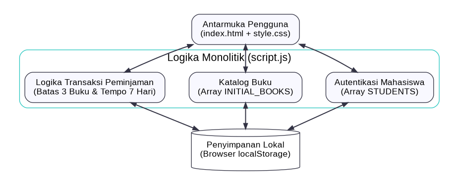
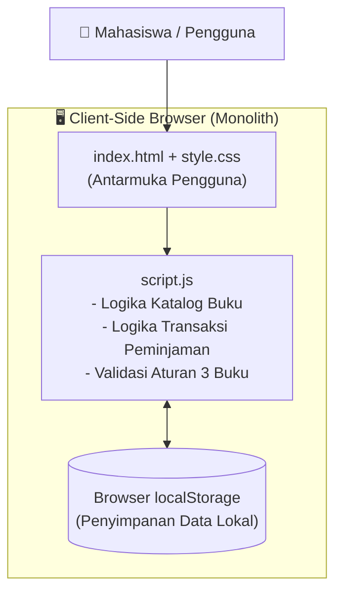
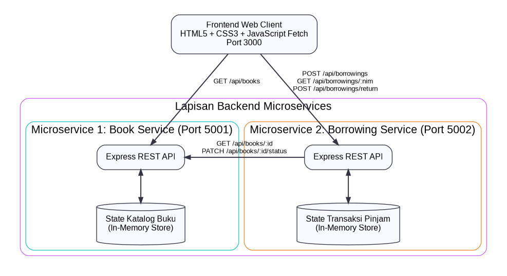
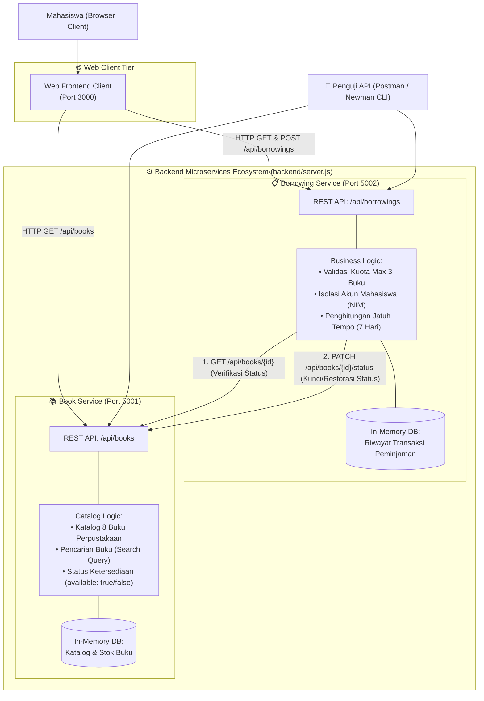
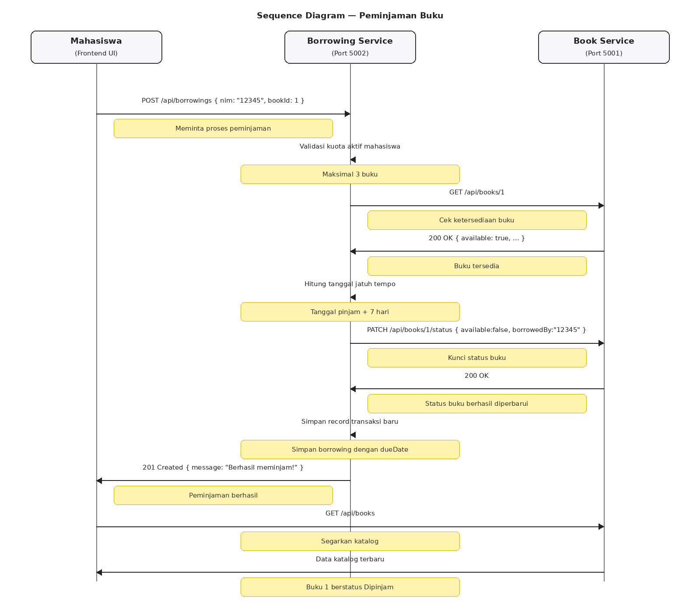
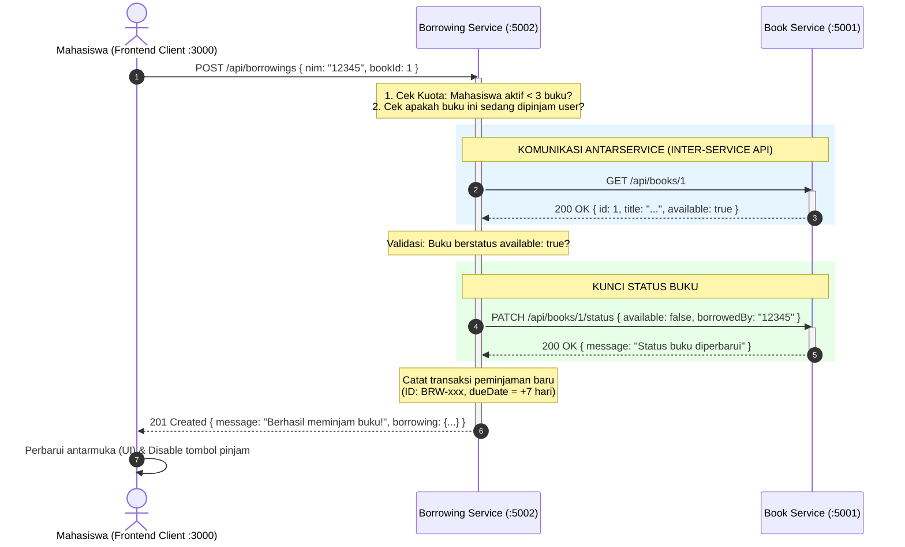
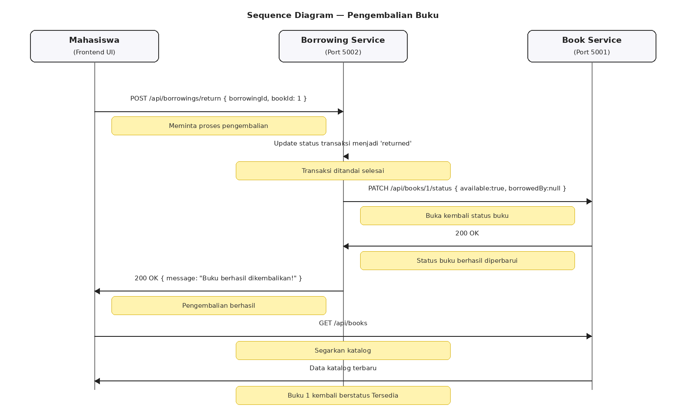
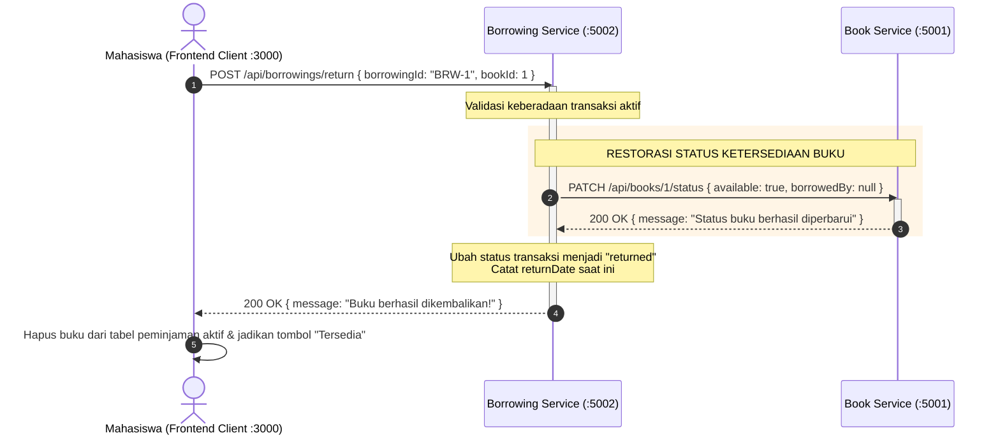

# 🏛️ Arsitektur Sistem Peminjaman Buku Perpustakaan (Microservices)

Dokumen ini menjelaskan rancangan arsitektur sistem peminjaman buku perpustakaan kampus, perbandingan sebelum vs sesudah transformasi ke *microservices*, diagram alur komunikasi antar-service, dan kontrak spesifikasi API.

---

## 1. Perbandingan Arsitektur: Sebelum vs Sesudah

### A. Arsitektur Sebelum (Monolith Client-Side)
Pada tahap awal (Pertemuan 1/Prototype awal), seluruh logika bisnis, pengelolaan data buku, validasi peminjaman, dan sesi login dijalankan secara terpusat di dalam satu aplikasi *client-side* browser menggunakan `localStorage`.

<b>Klik untuk melihat source code Mermaid (Arsitektur Sebelum)</b>

**Keterbatasan Arsitektur Awal:**
* Data hanya tersimpan di peramban masing-masing perangkat (tidak terdistribusi).
* Tidak ada pemisahan tanggung jawab (*separation of concerns*) antara katalog buku dan transaksi peminjaman.
* Sulit diintegrasikan dengan sistem pihak ketiga atau diuji secara independen.

---

### B. Arsitektur Sesudah (Microservices Architecture)
Arsitektur dipecah menjadi **2 layanan backend independen** berbasis Node.js & Express.js yang berjalan pada port berbeda dan saling berkomunikasi menggunakan protokol **HTTP REST API**, dikelola dalam satu folder terpadu `backend/` dengan ekosistem pengujian Postman:

<b>Klik untuk melihat source code Mermaid (Arsitektur Sesudah)</b>

---

## 2. Diagram Alur Inter-Service Communication

### A. Alur Peminjaman Buku (Borrowing Flow)
Ketika mahasiswa mengklik tombol **Pinjam Buku** di frontend, terjadi proses kolaborasi antar-service sebagai berikut:

<b>Klik untuk melihat source code Sequence Diagram (Peminjaman)</b>

---

### B. Alur Pengembalian Buku (Return Flow)
Ketika mahasiswa mengklik tombol **Kembalikan Buku**:

<b>Klik untuk melihat source code Sequence Diagram (Pengembalian)</b>

---

## 3. Kontrak Endpoint REST API

### 📚 A. Book Service (`http://localhost:5001`)

| Method | Endpoint | Fungsi | Parameter / Body | Response Code |
|---|---|---|---|---|
| `GET` | `/health` | Memeriksa keaktifan service | - | `200 OK` |
| `GET` | `/api/books` | Mengambil seluruh katalog buku | Query: `?search=keyword` (opsional) | `200 OK` |
| `GET` | `/api/books/:id` | Mengambil detail 1 buku berdasarkan ID | Path: `:id` (contoh: `/api/books/1`) | `200 OK` / `404 Not Found` |
| `PATCH` | `/api/books/:id/status` | Memperbarui status ketersediaan buku | Body: `{"available": boolean, "borrowedBy": string\|null}` | `200 OK` / `400 Bad Request` |
| `POST` | `/api/books/reset` | Mengembalikan katalog buku ke data awal | - | `200 OK` |

---

### 📋 B. Borrowing Service (`http://localhost:5002`)

| Method | Endpoint | Fungsi | Parameter / Body | Response Code |
|---|---|---|---|---|
| `GET` | `/health` | Memeriksa keaktifan service | - | `200 OK` |
| `GET` | `/api/borrowings` | Mengambil seluruh transaksi peminjaman | - | `200 OK` |
| `GET` | `/api/borrowings/:nim` | Mengambil riwayat peminjaman per mahasiswa | Path: `:nim` (contoh: `/api/borrowings/12345`) | `200 OK` |
| `POST` | `/api/borrowings` | Transaksi peminjaman buku (Inter-Service) | Body: `{"nim": "12345", "bookId": 1}` | `201 Created` / `400 Bad Request` / `503 Unavailable` |
| `POST` | `/api/borrowings/return` | Pengembalian buku (Inter-Service) | Body: `{"borrowingId": "BRW-xxx", "bookId": 1}` | `200 OK` / `404 Not Found` |
| `POST` | `/api/borrowings/reset` | Mereset seluruh transaksi peminjaman | - | `200 OK` |

---

## 4. Keunggulan Arsitektur yang Diterapkan

1. **Pemisahan Tanggung Jawab (*Single Responsibility Principle*)**:
   * Tim katalog buku dapat mengembangkan fitur buku tanpa menyentuh logika peminjaman.
   * Tim transaksi fokus pada aturan bisnis kuota, tanggal jatuh tempo, dan riwayat mahasiswa.
2. **Resilience & Fault Isolation**:
   * Jika Borrowing Service mengalami lonjakan traffic, katalog buku di Book Service tetap dapat diakses publik untuk pencarian buku.
3. **Kemudahan Pengujian (*Testability*)**:
   * Tersedia koleksi Postman Collection terstandar yang dapat diuji otomatis secara terisolasi maupun *end-to-end* via terminal (`npm run test:api`).
