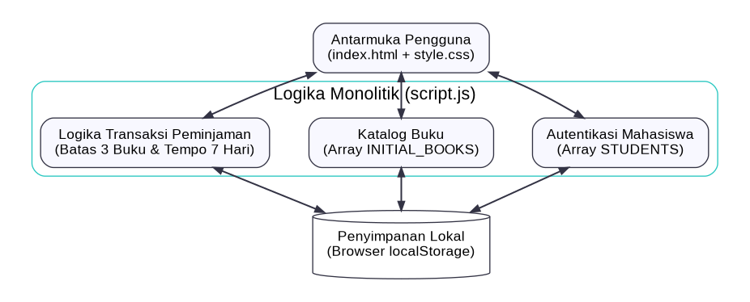
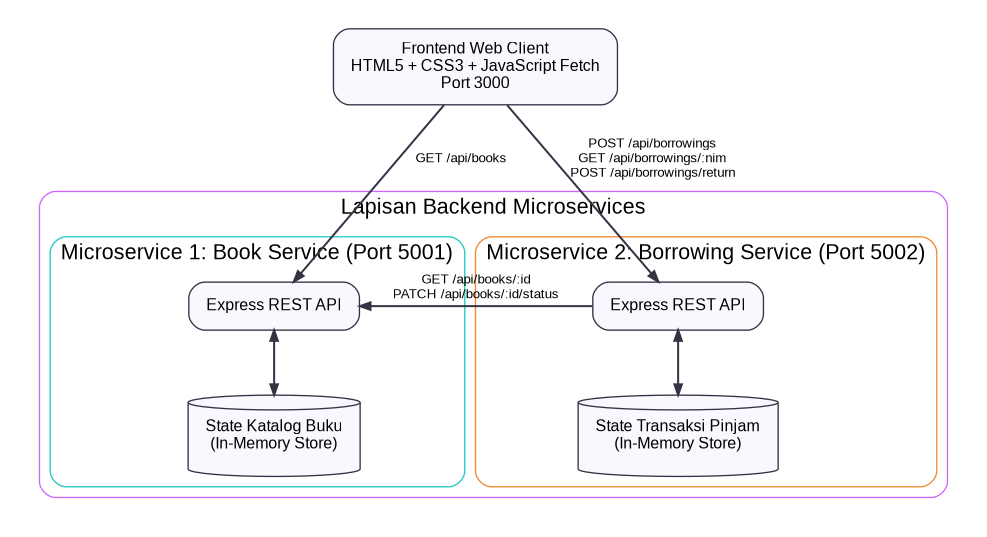
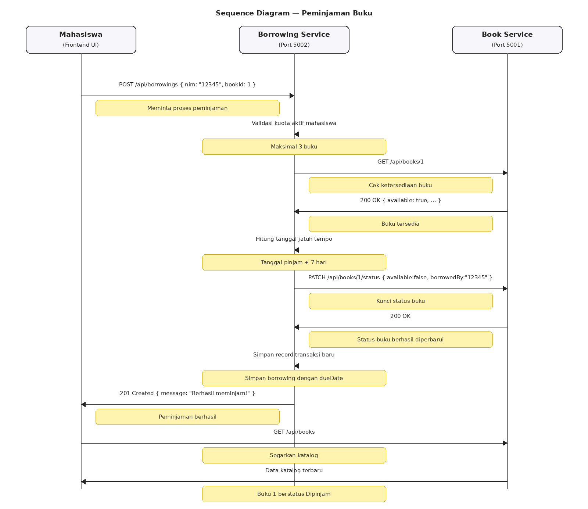
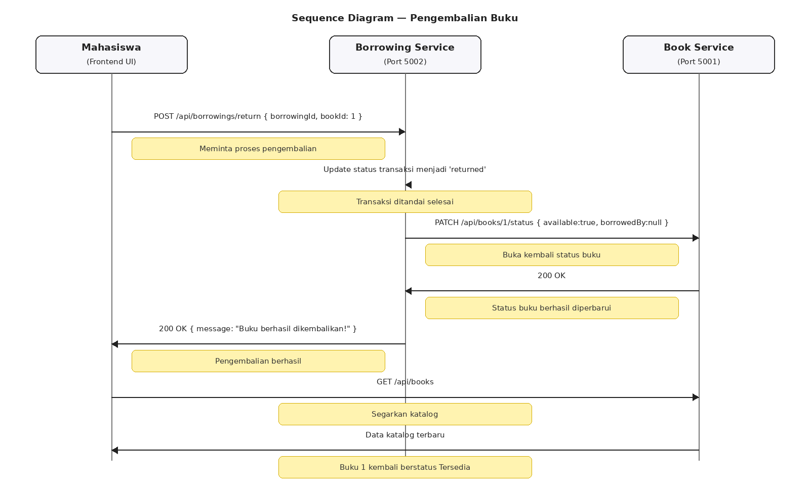

# Dokumentasi Diagram Arsitektur Sistem Peminjaman Buku Perpustakaan

Dokumen ini menjelaskan perubahan **Sistem Peminjaman Buku Perpustakaan** dari sistem awal yang seluruh prosesnya berjalan di browser menjadi sistem yang menggunakan **arsitektur microservices berbasis REST API**.

Penjelasan dibuat bertahap agar mudah dipahami. Secara sederhana, perubahan yang terjadi adalah:

> **Sebelum:** browser menyimpan dan mengolah hampir semua data sendiri.
>
> **Sesudah:** browser menjadi frontend, sedangkan pekerjaan dibagi ke dua backend: **Book Service** dan **Borrowing Service**.

---

## 1. Arsitektur Sebelum — Monolitik Client-Side

Pada sistem awal, aplikasi berjalan di browser. File `index.html` menampilkan halaman, `style.css` mengatur tampilan, sedangkan `script.js` menangani logika aplikasi.

Logika seperti autentikasi mahasiswa, katalog buku, aturan maksimal 3 buku, dan pencatatan transaksi berada di satu sisi, yaitu browser. Data juga disimpan menggunakan `localStorage`.



**Gambar 1. Arsitektur sistem sebelum migrasi ke microservices.**

### Cara kerja sederhananya

Misalnya mahasiswa login dengan NIM `12345`, kemudian memilih buku **Basis Data**.

Pada sistem lama, alurnya kira-kira seperti ini:

1. Mahasiswa membuka halaman web.
2. `script.js` membaca data mahasiswa dari array `STUDENTS`.
3. `script.js` membaca daftar buku dari `INITIAL_BOOKS`.
4. Ketika mahasiswa meminjam, `script.js` memeriksa apakah mahasiswa masih memiliki kurang dari 3 buku.
5. Data peminjaman disimpan kembali ke `localStorage`.

Artinya, browser menjadi tempat **tampilan + logika + penyimpanan data** sekaligus.

### Contoh masalahnya

Jika data peminjaman tersimpan di `localStorage` pada laptop A, data tersebut tidak otomatis menjadi data yang sama pada laptop B. Jadi, sistem belum memiliki penyimpanan backend yang terpusat.

Hal ini berbeda dengan microservices karena data katalog dan transaksi dikelola oleh service backend masing-masing.

---

## 2. Arsitektur Sesudah — Microservices Berbasis REST API

Setelah dikembangkan, sistem dibagi menjadi tiga bagian utama:

1. **Frontend Web Client — Port 3000**
2. **Book Service — Port 5001**
3. **Borrowing Service — Port 5002**



**Gambar 2. Arsitektur sistem setelah menggunakan microservices.**

### 2.1 Frontend Web Client — Port 3000

Frontend adalah bagian yang dilihat dan digunakan mahasiswa. Frontend menggunakan `HTML`, `CSS`, dan `JavaScript`.

Frontend tidak lagi menjadi tempat utama penyimpanan data. JavaScript menggunakan `fetch()` untuk meminta data kepada backend melalui HTTP/REST API.

**Contoh:**

```text
Frontend
   |
   | GET /api/books
   v
Book Service (5001)
```

Artinya frontend berkata kepada Book Service:

> "Tolong berikan daftar buku yang tersedia."

Book Service kemudian mengirim data katalog kembali ke frontend.

---

### 2.2 Book Service — Port 5001

Book Service mempunyai tanggung jawab khusus terhadap **data buku**.

Tanggung jawab utamanya:

- menyimpan data ID buku;
- menyimpan judul buku;
- menyimpan penulis;
- melakukan pencarian buku;
- mengetahui apakah buku tersedia atau sedang dipinjam;
- mengubah status buku ketika dipinjam atau dikembalikan.

Contoh data buku:

```json
{
  "id": 1,
  "title": "Basis Data",
  "author": "Abdul Kadir",
  "available": true,
  "borrowedBy": null
}
```

Jika buku dipinjam oleh NIM `12345`, statusnya dapat berubah menjadi:

```json
{
  "id": 1,
  "title": "Basis Data",
  "author": "Abdul Kadir",
  "available": false,
  "borrowedBy": "12345"
}
```

Jadi, Book Service tidak bertugas menghitung kuota peminjaman mahasiswa. Tugas tersebut berada pada Borrowing Service.

---

### 2.3 Borrowing Service — Port 5002

Borrowing Service mempunyai tanggung jawab terhadap **proses transaksi peminjaman**.

Tanggung jawabnya antara lain:

- menerima permintaan peminjaman;
- mengecek jumlah buku aktif milik mahasiswa;
- menerapkan batas maksimal **3 buku**;
- menghitung tanggal jatuh tempo **7 hari**;
- menyimpan transaksi peminjaman;
- memproses pengembalian;
- meminta Book Service mengecek dan mengubah status buku.

Contoh sederhana:

> Mahasiswa NIM `12345` sudah meminjam 2 buku. Ketika meminjam buku ketiga, Borrowing Service masih mengizinkan. Jika mahasiswa mencoba meminjam buku keempat, permintaan harus ditolak karena batas maksimal adalah 3 buku.

---

## 3. Mengapa Book Service dan Borrowing Service Dipisahkan?

Pemisahan dilakukan agar setiap service mempunyai tanggung jawab yang jelas.

| Service | Port | Fokus Utama | Contoh Tugas |
|---|---:|---|---|
| **Book Service** | `5001` | Data buku | Menampilkan katalog, mencari buku, mengubah status tersedia/dipinjam |
| **Borrowing Service** | `5002` | Transaksi peminjaman | Mengecek kuota, menghitung jatuh tempo, menyimpan transaksi, mengembalikan buku |

Contohnya, jika aturan peminjaman berubah dari **maksimal 3 buku menjadi maksimal 5 buku**, bagian yang berkaitan dengan aturan tersebut berada di Borrowing Service. Book Service tetap fokus pada data dan status buku.

---

## 4. Alur Komunikasi Antarservice

Bagian ini merupakan bagian yang paling tepat untuk menggunakan **sequence diagram** karena sequence diagram menunjukkan **urutan komunikasi dari satu komponen ke komponen lain**.

Pada sistem ini terdapat dua alur utama:

1. **Peminjaman buku**
2. **Pengembalian buku**

---

# 4.1 Sequence Diagram Peminjaman Buku



**Gambar 3. Sequence diagram proses peminjaman buku.**

### Penjelasan langkah demi langkah

#### Langkah 1 — Mahasiswa memilih buku

Mahasiswa memilih buku melalui frontend. Misalnya:

```text
NIM     : 12345
Buku ID : 1
Buku    : Basis Data
```

Frontend mengirim:

```http
POST /api/borrowings
```

dengan data seperti:

```json
{
  "nim": "12345",
  "bookId": 1
}
```

---

#### Langkah 2 — Borrowing Service mengecek kuota

Borrowing Service menerima permintaan tersebut dan memeriksa jumlah peminjaman aktif mahasiswa.

Contoh:

```text
Peminjaman aktif NIM 12345 = 2 buku
Batas maksimal             = 3 buku
```

Karena `2 < 3`, mahasiswa masih boleh meminjam.

Jika jumlahnya sudah 3:

```text
Peminjaman aktif = 3
Batas maksimal   = 3
```

maka permintaan peminjaman ditolak.

---

#### Langkah 3 — Borrowing Service meminta Book Service mengecek buku

Borrowing Service belum mengetahui status terbaru buku secara langsung. Oleh karena itu, Borrowing Service memanggil Book Service:

```http
GET /api/books/1
```

Tujuannya adalah memastikan buku ID `1` benar-benar tersedia.

Contoh respons:

```json
{
  "id": 1,
  "title": "Basis Data",
  "available": true
}
```

---

#### Langkah 4 — Sistem menghitung tanggal jatuh tempo

Setelah kuota memenuhi syarat dan buku tersedia, Borrowing Service menghitung tanggal jatuh tempo.

Aturan sistem:

> **Tanggal jatuh tempo = tanggal peminjaman + 7 hari**

Contoh:

```text
Tanggal pinjam : 19 September 2026
Lama pinjam    : 7 hari
Jatuh tempo    : 26 September 2026
```

Jadi jika mahasiswa meminjam pada **19 September 2026**, maka tanggal jatuh temponya adalah **26 September 2026**.

Perhitungan ini menjadi tanggung jawab Borrowing Service karena termasuk aturan bisnis transaksi peminjaman.

---

#### Langkah 5 — Book Service mengubah status buku

Setelah buku dinyatakan tersedia, Borrowing Service meminta Book Service mengubah statusnya:

```http
PATCH /api/books/1/status
```

Contoh data:

```json
{
  "available": false,
  "borrowedBy": "12345"
}
```

Artinya buku tersebut sekarang sedang dipinjam oleh mahasiswa dengan NIM `12345`.

---

#### Langkah 6 — Borrowing Service menyimpan transaksi

Setelah status buku berhasil diperbarui, Borrowing Service menyimpan transaksi.

Contoh data transaksi:

```json
{
  "borrowingId": "BRW-001",
  "nim": "12345",
  "bookId": 1,
  "status": "active",
  "borrowDate": "2026-09-19",
  "dueDate": "2026-09-26"
}
```

---

#### Langkah 7 — Frontend menerima hasil

Borrowing Service mengirim respons sukses kepada frontend:

```text
201 Created
Berhasil meminjam!
```

Frontend kemudian dapat menyegarkan katalog. Buku yang sebelumnya bertuliskan **Tersedia** sekarang menjadi **Dipinjam**.

### Ringkasan alur peminjaman

```text
Mahasiswa
   ↓
Frontend
   ↓ POST /api/borrowings
Borrowing Service
   ↓ cek kuota < 3
   ↓ GET /api/books/1
Book Service
   ↓ buku tersedia
Borrowing Service
   ↓ hitung jatuh tempo + 7 hari
   ↓ PATCH status buku
Book Service
   ↓ status = dipinjam
Borrowing Service
   ↓ simpan transaksi
Frontend
   ↓
Peminjaman berhasil
```

---

# 4.2 Sequence Diagram Pengembalian Buku



**Gambar 4. Sequence diagram proses pengembalian buku.**

### Penjelasan langkah demi langkah

#### Langkah 1 — Mahasiswa menekan tombol Kembalikan

Pada halaman peminjaman aktif, mahasiswa menekan tombol **Kembalikan Buku**.

Frontend mengirim:

```http
POST /api/borrowings/return
```

Contoh data:

```json
{
  "borrowingId": "BRW-001",
  "bookId": 1
}
```

---

#### Langkah 2 — Borrowing Service memperbarui transaksi

Borrowing Service mengubah status transaksi dari:

```text
active
```

menjadi:

```text
returned
```

Dengan demikian, transaksi tercatat sebagai riwayat pengembalian.

---

#### Langkah 3 — Borrowing Service meminta Book Service membuka status buku

Borrowing Service memanggil:

```http
PATCH /api/books/1/status
```

dengan data:

```json
{
  "available": true,
  "borrowedBy": null
}
```

Artinya buku sudah tidak terikat dengan mahasiswa tersebut dan dapat dipinjam kembali.

---

#### Langkah 4 — Frontend memperbarui tampilan

Setelah Book Service berhasil mengubah status, frontend mengambil katalog terbaru:

```http
GET /api/books
```

Buku yang sebelumnya berstatus **Dipinjam** sekarang tampil sebagai **Tersedia**.

### Contoh sederhana

Sebelum dikembalikan:

```text
Basis Data
Status: Dipinjam
Dipinjam oleh: 12345
```

Setelah dikembalikan:

```text
Basis Data
Status: Tersedia
Dipinjam oleh: -
```

---

# 5. Kontrak Endpoint REST API

**Kontrak endpoint** adalah daftar "pintu" yang disediakan oleh setiap service. Bagian ini tidak perlu dibuat menjadi sequence diagram karena tujuannya bukan menunjukkan urutan proses, tetapi menjelaskan **API apa yang tersedia dan untuk apa digunakan**.

## 5.1 Book Service — `http://localhost:5001`

| Method | Endpoint | Fungsi | Contoh penggunaan |
|---|---|---|---|
| `GET` | `/health` | Mengecek apakah service aktif | Memastikan Book Service berjalan |
| `GET` | `/api/books` | Mengambil seluruh katalog | Menampilkan daftar buku |
| `GET` | `/api/books/:id` | Mengambil satu buku | Mengecek buku ID 1 |
| `PATCH` | `/api/books/:id/status` | Mengubah status buku | Mengubah Tersedia menjadi Dipinjam |
| `POST` | `/api/books/reset` | Mereset data buku | Mengembalikan data demo ke kondisi awal |

### Contoh endpoint katalog

```http
GET http://localhost:5001/api/books
```

Digunakan frontend untuk mendapatkan daftar buku.

### Contoh endpoint status

```http
PATCH http://localhost:5001/api/books/1/status
```

Digunakan ketika buku ID `1` harus diubah menjadi dipinjam atau tersedia kembali.

---

## 5.2 Borrowing Service — `http://localhost:5002`

| Method | Endpoint | Fungsi | Contoh penggunaan |
|---|---|---|---|
| `GET` | `/health` | Mengecek apakah service aktif | Memastikan Borrowing Service berjalan |
| `GET` | `/api/borrowings` | Mengambil semua transaksi | Melihat riwayat transaksi |
| `GET` | `/api/borrowings/:nim` | Mengambil transaksi berdasarkan NIM | Melihat pinjaman mahasiswa `12345` |
| `POST` | `/api/borrowings` | Membuat transaksi peminjaman | Mahasiswa meminjam buku |
| `POST` | `/api/borrowings/return` | Memproses pengembalian | Mahasiswa mengembalikan buku |
| `POST` | `/api/borrowings/reset` | Mereset data transaksi | Persiapan demo/pengujian |

### Contoh peminjaman

```http
POST http://localhost:5002/api/borrowings
```

Body:

```json
{
  "nim": "12345",
  "bookId": 1
}
```

Borrowing Service kemudian berkomunikasi dengan Book Service untuk memastikan buku ID `1` tersedia.

### Contoh melihat peminjaman mahasiswa

```http
GET http://localhost:5002/api/borrowings/12345
```

Endpoint tersebut digunakan untuk mengambil data pinjaman berdasarkan NIM `12345`.

### Contoh pengembalian

```http
POST http://localhost:5002/api/borrowings/return
```

Body:

```json
{
  "borrowingId": "BRW-001",
  "bookId": 1
}
```

---

# 6. Hubungan Antarbagian Diagram

Agar tidak tertukar, fungsi setiap bagian dokumentasi dapat dipahami seperti ini:

| Bagian | Pertanyaan yang Dijawab | Bentuk yang Cocok |
|---|---|---|
| Arsitektur sebelum | Sistem lama tersusun dari apa? | Diagram arsitektur |
| Arsitektur sesudah | Sistem baru tersusun dari apa? | Diagram arsitektur |
| Tanggung jawab service | Masing-masing service mengerjakan apa? | Tabel |
| Alur komunikasi antarservice | Service berkomunikasi bagaimana dan dalam urutan apa? | **Sequence diagram** |
| Kontrak REST API | API apa saja yang tersedia? | Tabel endpoint + contoh request |

Jadi, **sequence diagram tidak perlu dibuat untuk semua bagian**. Sequence diagram terutama digunakan pada bagian **Alur Komunikasi Antarservice**, yaitu proses peminjaman dan pengembalian buku.

---

# 7. Kesimpulan

Migrasi dari monolitik client-side ke microservices membuat tanggung jawab sistem menjadi lebih terpisah.

Pada sistem lama, browser menangani tampilan, logika, dan penyimpanan lokal. Pada sistem baru, frontend hanya menjadi client yang berkomunikasi dengan backend menggunakan REST API.

**Book Service** menangani data dan status buku, sedangkan **Borrowing Service** menangani transaksi, batas maksimal 3 buku, tanggal jatuh tempo 7 hari, dan pengembalian.

Contoh alur paling penting adalah ketika mahasiswa meminjam buku. Frontend mengirim permintaan ke Borrowing Service, Borrowing Service mengecek kuota dan meminta Book Service mengecek ketersediaan. Jika buku tersedia, status buku diubah menjadi dipinjam, tanggal jatuh tempo dihitung 7 hari, transaksi disimpan, lalu hasil dikirim kembali ke frontend.

Dengan demikian, diagram arsitektur menjelaskan **susunan sistem**, sedangkan sequence diagram menjelaskan **urutan proses dan komunikasi antarbagian sistem**.
