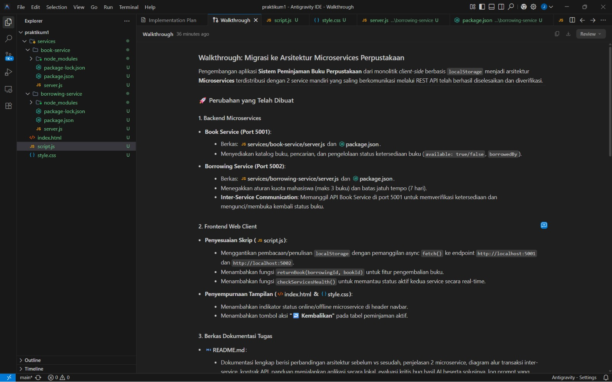
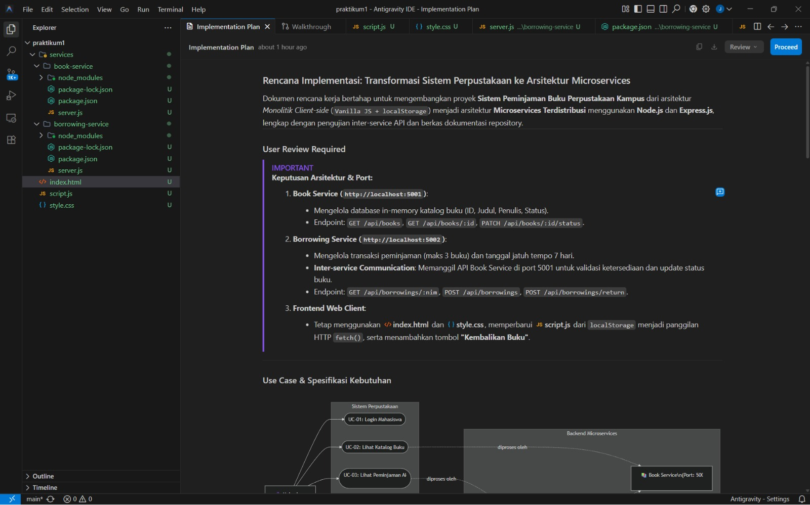

# Dokumentasi Penggunaan AI Coding Tool

Dokumen ini menjelaskan penggunaan **Google Antigravity IDE** dengan model **Gemini 3.8 Flash (High)** dalam pengembangan Sistem Peminjaman Buku Perpustakaan menjadi arsitektur microservices.

Dokumentasi ini tidak hanya menunjukkan bahwa AI digunakan, tetapi juga menjelaskan **untuk apa AI digunakan, apa hasilnya, bagaimana hasil tersebut diperiksa, masalah apa yang ditemukan, dan bagaimana masalah tersebut diperbaiki**.

---

## 1. Profil AI Coding Tool yang Digunakan

**Perangkat lunak:** Google Antigravity IDE  
**Model AI:** Gemini 3.8 Flash (High)  
**Proyek:** Sistem Peminjaman Buku Perpustakaan  
**Arsitektur:** Microservices dengan REST API  

AI digunakan sebagai alat bantu selama proses pengembangan. AI membantu membuat rancangan awal, struktur file, kode backend, komunikasi API, perubahan frontend, serta membantu mencari kemungkinan penyebab error.

Namun, hasil dari AI **tidak langsung dianggap benar**. Kode tetap perlu diperiksa dan dijalankan karena AI dapat menghasilkan kode yang secara sintaks terlihat benar tetapi belum tentu sesuai dengan kondisi proyek.

---

# 2. Dokumentasi Screenshot Interaksi dengan AI

Screenshot berikut merupakan dokumentasi proses kerja menggunakan AI Coding Tool.

## 2.1 Screenshot 1 — Browser Testing Plan & Progress


**Gambar 1. Browser Testing Plan & Progress.**

### Apa yang terlihat pada screenshot?

Screenshot ini menunjukkan daftar tahapan pengujian aplikasi pada browser. Tahapan yang terlihat antara lain:

1. membuka `http://localhost:3000`;
2. login menggunakan akun demo;
3. memastikan halaman perpustakaan muncul;
4. memastikan status Book Service `5001` dan Borrowing Service `5002` terlihat aktif;
5. mengecek daftar buku;
6. mencoba meminjam buku yang tersedia;
7. memastikan buku muncul pada daftar **Peminjaman Aktif Saya**;
8. mencoba tombol **Kembalikan**;
9. memastikan buku kembali menjadi **Tersedia**;
10. menyusun hasil pengujian.

### Contoh pengujian

Misalnya mahasiswa meminjam buku **Basis Data**.

Sebelum peminjaman:

```text
Basis Data
Status: Tersedia
```

Setelah mahasiswa menekan tombol **Pinjam**:

```text
Basis Data
Status: Dipinjam
```

Setelah mahasiswa menekan tombol **Kembalikan**:

```text
Basis Data
Status: Tersedia
```

Jadi screenshot ini menunjukkan bahwa pengembangan tidak berhenti pada pembuatan kode, tetapi dilanjutkan dengan pengujian alur aplikasi.

---

## 2.2 Screenshot 2 — Walkthrough Hasil Implementasi



**Gambar 2. Walkthrough hasil migrasi sistem ke microservices.**

### Apa yang dijelaskan AI?

Pada screenshot ini, AI mendokumentasikan hasil migrasi dari aplikasi monolitik client-side menjadi microservices.

AI menjelaskan dua backend utama:

- **Book Service pada port 5001**
- **Borrowing Service pada port 5002**

AI juga menjelaskan perubahan pada frontend, yaitu penggunaan `fetch()` untuk berkomunikasi dengan endpoint backend dan penambahan fitur pengembalian buku.

### Contoh perubahan

Sebelum migrasi, data dapat dibaca dari browser menggunakan mekanisme seperti:

```text
localStorage
```

Setelah migrasi, frontend meminta data kepada backend menggunakan:

```javascript
fetch('http://localhost:5001/api/books')
```

Untuk peminjaman, frontend dapat berkomunikasi dengan:

```javascript
fetch('http://localhost:5002/api/borrowings', {
  method: 'POST'
})
```

Dengan demikian, frontend tidak lagi menyimpan seluruh logika transaksi sendiri.

---

## 2.3 Screenshot 3 — Implementation Plan



**Gambar 3. Implementation Plan transformasi sistem perpustakaan ke microservices.**

### Apa tujuan Implementation Plan?

Implementation Plan berfungsi sebagai rencana kerja sebelum atau selama proses implementasi. Pada screenshot terlihat pembagian sistem menjadi:

1. **Book Service** pada `http://localhost:5001`;
2. **Borrowing Service** pada `http://localhost:5002`;
3. **Frontend Web Client**.

AI juga mencantumkan aturan bisnis yang penting, yaitu:

- maksimal peminjaman 3 buku;
- tanggal jatuh tempo 7 hari;
- Borrowing Service melakukan komunikasi ke Book Service untuk validasi ketersediaan dan perubahan status buku.

### Contoh pembagian tanggung jawab

Jika mahasiswa ingin melihat katalog:

```text
Frontend → Book Service
```

Jika mahasiswa ingin meminjam buku:

```text
Frontend → Borrowing Service → Book Service
```

Hal tersebut menunjukkan bahwa Borrowing Service menjadi bagian yang mengatur proses transaksi, sedangkan Book Service tetap fokus pada data buku.

---

## 2.4 Screenshot 4 — Prompt Awal dan Rancangan Pemecahan Service


**Gambar 4. Interaksi awal dengan AI Coding Tool.**

### Apa yang diminta kepada AI?

Pada percakapan tersebut, AI diberikan ketentuan utama proyek, yaitu mengembangkan proyek yang sudah ada dan mengubah arsitekturnya menjadi minimal dua service yang terpisah.

Beberapa kebutuhan utama yang ditekankan adalah:

- proyek lama tetap digunakan;
- minimal terdapat dua service/microservice;
- setiap service memiliki fungsi dan tanggung jawab yang jelas;
- service dapat saling berkomunikasi menggunakan REST API atau HTTP;
- terdapat minimal satu alur fitur end-to-end yang melibatkan komunikasi antarservice.

### Contoh penerapannya

Kebutuhan tersebut kemudian diterapkan menjadi:

```text
Book Service
Port 5001
↓
Mengelola katalog dan status buku
```

serta:

```text
Borrowing Service
Port 5002
↓
Mengelola transaksi peminjaman dan pengembalian
```

Kedua service kemudian berkomunikasi ketika mahasiswa meminjam atau mengembalikan buku.

---

# 3. Peran AI dalam Pengembangan

AI digunakan dalam beberapa tahap pengembangan.

## 3.1 Membantu merancang arsitektur

AI membantu mengubah sistem yang awalnya berada dalam satu aplikasi client-side menjadi beberapa bagian yang lebih terpisah.

Contohnya:

```text
Sebelum:
Frontend + Logika + Data Lokal

Sesudah:
Frontend
   ↓
Book Service
Borrowing Service
```

Tujuannya adalah agar tanggung jawab setiap bagian lebih jelas.

---

## 3.2 Membuat scaffolding backend

AI membantu membuat struktur dasar untuk:

```text
services/
├── book-service/
│   ├── package.json
│   └── server.js
│
└── borrowing-service/
    ├── package.json
    └── server.js
```

`server.js` digunakan untuk menjalankan server Express masing-masing service, sedangkan `package.json` berisi informasi dan dependensi yang dibutuhkan.

---

## 3.3 Membantu membuat REST API

AI membantu merancang endpoint seperti:

```text
GET   /api/books
GET   /api/books/:id
PATCH /api/books/:id/status
```

dan:

```text
GET  /api/borrowings/:nim
POST /api/borrowings
POST /api/borrowings/return
```

Contohnya, ketika frontend meminta katalog:

```text
GET http://localhost:5001/api/books
```

Book Service mengembalikan data buku.

---

## 3.4 Membantu komunikasi antarservice

Bagian penting dari tugas microservices adalah adanya komunikasi antarservice.

Borrowing Service memanggil Book Service melalui HTTP.

Contoh konsepnya:

```text
Borrowing Service (5002)
        |
        | GET /api/books/1
        v
Book Service (5001)
```

Jika buku tersedia, Borrowing Service kemudian dapat meminta perubahan status:

```text
PATCH /api/books/1/status
```

---

## 3.5 Membantu refaktor frontend

Frontend yang sebelumnya menggunakan `localStorage` diarahkan untuk mengambil data dari backend menggunakan `fetch()`.

Contoh sederhana:

```javascript
const response = await fetch('http://localhost:5001/api/books');
const books = await response.json();
```

Dengan pendekatan tersebut, data katalog berasal dari Book Service.

---

## 3.6 Membantu fitur pengembalian buku

Pada pengembangan awal, fitur pengembalian belum tersedia secara lengkap pada antarmuka.

AI membantu menambahkan endpoint:

```text
POST /api/borrowings/return
```

dan fungsi frontend untuk menjalankan pengembalian.

Contohnya:

```text
Mahasiswa klik "Kembalikan"
        ↓
Frontend
        ↓
Borrowing Service
        ↓
Book Service
        ↓
Status buku = Tersedia
```

---

# 4. Pemeriksaan Hasil AI

Bagian ini penting karena kode dari AI tidak boleh langsung dianggap benar hanya karena berhasil dibuat.

Kode harus:

1. dibaca;
2. dibandingkan dengan kebutuhan tugas;
3. dijalankan;
4. diuji dengan data nyata;
5. diperbaiki jika muncul error.

Contohnya, AI dapat membuat pemanggilan API seperti berikut:

```javascript
await fetch('http://localhost:5001/api/books/1');
```

Tetapi jika Book Service sedang mati, kode tersebut dapat mengalami error. Karena itu diperlukan penanganan error menggunakan `try-catch`.

---

# 5. Masalah / Kesalahan yang Ditemukan dari Hasil AI dan Solusinya

## 5.1 CORS Policy Error

### Masalah

Frontend berjalan pada port `3000`, sedangkan backend berjalan pada port `5001` dan `5002`.

Contohnya:

```text
Frontend       : http://localhost:3000
Book Service   : http://localhost:5001
Borrowing      : http://localhost:5002
```

Browser menganggap ketiganya memiliki origin yang berbeda. Jika backend belum mengizinkan request dari frontend, request dapat diblokir oleh kebijakan CORS.

### Solusi

Dependensi `cors` ditambahkan dan middleware digunakan pada service Express.

Contoh:

```javascript
const cors = require('cors');
app.use(cors());
```

### Hasil yang diharapkan

Setelah CORS diperbaiki, frontend dapat memanggil API backend dari port yang berbeda.

---

## 5.2 Inkonsistensi Tipe Data ID Buku

### Masalah

ID buku dari HTML atau input frontend dapat diterima sebagai string:

```text
"1"
```

sedangkan data pada backend dapat berupa integer:

```text
1
```

Jika kode menggunakan perbandingan ketat:

```javascript
book.id === bookId
```

maka:

```text
1 === "1"
```

bernilai `false`.

### Solusi

ID dikonversi terlebih dahulu, misalnya:

```javascript
const id = parseInt(bookId);
```

Sehingga perbandingannya menjadi konsisten:

```text
1 === 1
```

### Contoh sederhana

Jika tombol mengirim:

```text
bookId = "1"
```

maka program mengubahnya menjadi:

```text
bookId = 1
```

sebelum melakukan pencarian data.

---

## 5.3 Book Service Offline

### Masalah

Borrowing Service perlu memanggil Book Service ketika mahasiswa meminjam atau mengembalikan buku.

Jika Book Service mati, misalnya:

```text
Book Service (5001) = OFFLINE
Borrowing Service (5002) = ONLINE
```

maka pemanggilan `fetch()` dapat gagal.

Jika tidak ditangani, error jaringan dapat menyebabkan proses tidak memberikan respons yang sesuai kepada frontend.

### Solusi

Pemanggilan API dibungkus menggunakan `try-catch`.

Contoh konsep:

```javascript
try {
  const response = await fetch(bookServiceUrl);
} catch (error) {
  // tangani kegagalan komunikasi
}
```

Service kemudian dapat mengembalikan:

```text
503 Service Unavailable
```

Artinya masalah terjadi karena service yang dibutuhkan sedang tidak tersedia.

---

## 5.4 Fitur Pengembalian Belum Ada di UI

### Masalah

Pada versi awal, proses peminjaman sudah tersedia tetapi tombol pengembalian belum tersedia secara lengkap pada tampilan.

Akibatnya mahasiswa dapat meminjam buku, tetapi tidak mempunyai cara yang jelas untuk mengembalikannya melalui UI.

### Solusi

Ditambahkan:

- endpoint `POST /api/borrowings/return`;
- fungsi `returnBook(borrowingId, bookId)`;
- tombol **Kembalikan** pada tabel peminjaman aktif.

### Contoh alur

```text
Klik "Kembalikan"
       ↓
POST /api/borrowings/return
       ↓
Borrowing Service
       ↓
PATCH /api/books/1/status
       ↓
Book Service
       ↓
available = true
       ↓
Buku kembali menjadi Tersedia
```

---

# 6. Contoh Pengujian End-to-End

Untuk memastikan microservices benar-benar bekerja, satu alur lengkap dapat diuji dari awal sampai akhir.

## Contoh: Mahasiswa NIM 12345 meminjam Buku ID 1

### Kondisi awal

```text
Book Service      : ONLINE
Borrowing Service : ONLINE
Buku ID 1         : Tersedia
Peminjaman aktif  : 2 buku
```

### Proses

```text
1. Mahasiswa klik Pinjam
2. Frontend → Borrowing Service
3. Borrowing Service mengecek kuota
4. Borrowing Service → Book Service
5. Book Service menyatakan buku tersedia
6. Borrowing Service menghitung jatuh tempo +7 hari
7. Borrowing Service → Book Service untuk mengubah status
8. Transaksi disimpan
9. Frontend menerima respons berhasil
```

### Hasil

```text
Status buku      : Dipinjam
Dipinjam oleh    : 12345
Tanggal pinjam   : 19-09-2026
Jatuh tempo      : 26-09-2026
Jumlah pinjaman  : 3 buku
```

Contoh tersebut membuktikan bahwa satu fitur dapat melibatkan lebih dari satu service.

---

# 7. Contoh Pengujian Pengembalian

Misalnya mahasiswa yang sama mengembalikan Buku ID 1.

### Proses

```text
1. Mahasiswa klik Kembalikan
2. Frontend → Borrowing Service
3. Transaksi diubah menjadi returned
4. Borrowing Service → Book Service
5. Book Service mengubah available menjadi true
6. Frontend mengambil katalog terbaru
```

### Hasil

```text
Status transaksi : returned
Status buku      : Tersedia
Dipinjam oleh    : null
```

Kuota mahasiswa juga tidak lagi menggunakan buku tersebut sebagai pinjaman aktif.

---

# 8. Kesimpulan Evaluasi Penggunaan AI

Penggunaan AI Coding Tool membantu mempercepat proses pengembangan, terutama untuk pekerjaan seperti membuat struktur file, boilerplate Express, rancangan endpoint, komunikasi REST API, dan refaktor frontend.

Namun, AI bukan pengganti proses pengujian. Hasil AI tetap harus diperiksa karena dapat terdapat kesalahan yang baru terlihat ketika program dijalankan.

Dalam proyek ini, pemeriksaan menghasilkan beberapa temuan penting, yaitu:

- masalah CORS karena frontend dan backend menggunakan port berbeda;
- perbedaan tipe data ID buku antara frontend dan backend;
- perlunya penanganan ketika Book Service tidak dapat dihubungi;
- belum lengkapnya fitur pengembalian pada antarmuka.

Setelah masalah tersebut diperbaiki, AI tetap berperan sebagai **alat bantu coding**, sedangkan pengembang tetap bertanggung jawab untuk memeriksa kebutuhan, menguji aplikasi, memahami kode, dan menentukan perbaikan yang benar.
